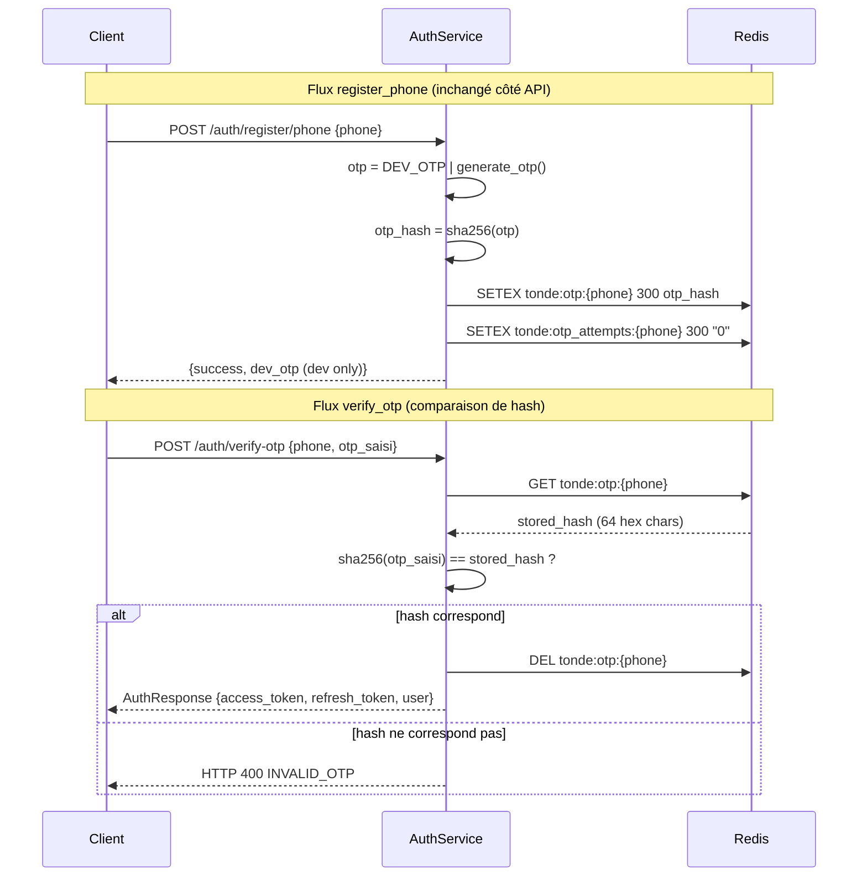

# Design Document — TASK-01 : Sécurité OTP SHA-256

## Overview

Ce document décrit les changements précis pour corriger la faille de sécurité critique : l'OTP stocké en clair dans Redis.

La solution est intentionnellement minimale : deux fonctions dans `app/core/redis.py` et une comparaison dans `app/services/auth_service.py`. Aucun nouveau module, aucun nouveau schéma, aucune migration Alembic. Le contrat API est inchangé.

**Avant :**
```
OTP généré ("123456") → Redis setex("tonde:otp:+25779...", 300, "123456")
Vérification : otp_saisi == stored_otp  (comparaison texte brut)
```

**Après :**
```
OTP généré ("123456") → sha256 → Redis setex("tonde:otp:+25779...", 300, "8d969e...")
Vérification : sha256(otp_saisi) == stored_hash  (comparaison de hash)
```

## Architecture

Aucun changement architectural. Le pattern `Router → Service → Redis` reste identique. Seule la sémantique de la valeur stockée dans Redis change.

```
POST /auth/verify-otp
  └── AuthService.verify_otp()
        ├── get_otp(phone)          → retourne le hash SHA-256 stocké
        ├── sha256(otp_saisi)       → calcule le hash du code soumis
        └── hash_saisi == stored_hash  → comparaison sécurisée
```



## Components and Interfaces

### 1. `app/core/redis.py` — Fonction `_hash_otp()` (nouvelle, privée)

Fonction pure extraite pour être testable indépendamment et réutilisable.

```python
import hashlib

def _hash_otp(otp: str) -> str:
    """
    Calcule le hash SHA-256 d'un OTP.

    L'OTP ne doit jamais être stocké en clair. Cette fonction est
    l'unique point de hashage — toute persistance OTP passe par ici.

    Args:
        otp: Code OTP en clair (ex: "123456")

    Returns:
        Chaîne hexadécimale de 64 caractères (SHA-256)
    """
    return hashlib.sha256(otp.encode()).hexdigest()
```

### 2. `app/core/redis.py` — `save_otp()` modifiée

**Avant :**
```python
async def save_otp(phone: str, otp: str) -> None:
    r = await get_redis()
    expire_seconds = settings.OTP_EXPIRE_MINUTES * 60
    await r.setex(f"tonde:otp:{phone}", expire_seconds, otp)  # ← OTP EN CLAIR
    await r.setex(f"tonde:otp_attempts:{phone}", expire_seconds, "0")
```

**Après :**
```python
async def save_otp(phone: str, otp: str) -> None:
    """
    Sauvegarde le HASH SHA-256 de l'OTP dans Redis avec TTL automatique.
    Réinitialise aussi le compteur de tentatives.

    L'OTP en clair n'est jamais persisté. Si Redis est compromis,
    les hash stockés ne permettent pas de reconstituer les codes originaux.

    Args:
        phone: Numéro de téléphone normalisé
        otp: Code OTP en clair (hashé avant persistance)
    """
    r = await get_redis()
    expire_seconds = settings.OTP_EXPIRE_MINUTES * 60
    await r.setex(f"tonde:otp:{phone}", expire_seconds, _hash_otp(otp))  # ← HASH
    await r.setex(f"tonde:otp_attempts:{phone}", expire_seconds, "0")
```

### 3. `app/core/redis.py` — `get_otp()` — docstring mise à jour uniquement

La signature et le comportement ne changent pas. La fonction retourne désormais un hash SHA-256 (64 chars) ou `None`. La docstring est mise à jour pour refléter cela.

```python
async def get_otp(phone: str) -> Optional[str]:
    """
    Récupère le hash SHA-256 de l'OTP stocké pour un numéro.

    Returns:
        Hash SHA-256 (64 caractères hexadécimaux) ou None si expiré/absent.
        La valeur retournée est un hash, jamais le code OTP en clair.
    """
    r = await get_redis()
    return await r.get(f"tonde:otp:{phone}")
```

### 4. `app/services/auth_service.py` — `verify_otp()` modifiée

**Avant :**
```python
# Comparer les OTP
if otp != stored_otp:
    raise HTTPException(...)
```

**Après :**
```python
# Comparer les hash SHA-256 (jamais les valeurs en clair)
if _hash_otp(otp) != stored_otp:
    raise HTTPException(...)
```

L'import de `hashlib` n'est pas nécessaire dans `auth_service.py` car on délègue à `_hash_otp`. Il faut importer cette fonction depuis `app.core.redis` :

```python
from app.core.redis import (
    save_otp, get_otp, delete_otp,
    increment_otp_attempts,
    _hash_otp,  # ← ajout
)
```

**Méthode `verify_otp()` complète après modification :**
```python
async def verify_otp(self, data: VerifyOtpRequest) -> AuthResponse:
    """
    Vérifie l'OTP en comparant les hash SHA-256 et retourne les tokens JWT.
    Crée automatiquement le compte si c'est le premier login.

    La comparaison porte sur les hash, jamais sur les valeurs en clair.

    Args:
        data: phone + otp saisi par l'utilisateur

    Returns:
        AuthResponse avec access_token, refresh_token, user

    Raises:
        HTTPException 400: OTP expiré (clé Redis absente) ou invalide (hash mismatch)
        HTTPException 429: Trop de tentatives
    """
    phone = data.phone
    otp = data.otp

    # Vérifier que l'OTP existe encore dans Redis
    stored_hash = await get_otp(phone)
    if not stored_hash:
        raise HTTPException(
            status_code=status.HTTP_400_BAD_REQUEST,
            detail={"code": "OTP_EXPIRED", "message": "Le code OTP a expiré. Demandez un nouveau code."},
        )

    # Incrémenter et vérifier le compteur de tentatives
    attempts = await increment_otp_attempts(phone)
    if attempts > settings.OTP_MAX_ATTEMPTS:
        raise HTTPException(
            status_code=status.HTTP_429_TOO_MANY_REQUESTS,
            detail={"code": "TOO_MANY_ATTEMPTS", "message": "Trop de tentatives. Demandez un nouveau code."},
        )

    # Comparer les hash SHA-256 — jamais les valeurs en clair
    if _hash_otp(otp) != stored_hash:
        raise HTTPException(
            status_code=status.HTTP_400_BAD_REQUEST,
            detail={
                "code": "INVALID_OTP",
                "message": f"Code incorrect. Tentative {attempts}/{settings.OTP_MAX_ATTEMPTS}",
            },
        )

    # OTP correct → supprimer de Redis
    await delete_otp(phone)

    # Chercher ou créer l'utilisateur
    user = await self._get_or_create_user_by_phone(phone)
    user.is_verified = True
    user.last_login = datetime.now(timezone.utc)
    await self.db.commit()
    await self.db.refresh(user)

    logger.info(f"Connexion réussie par OTP: {phone} | user_id={user.id}")

    return self._create_auth_response(user)
```

### 5. `tests/test_auth_service.py` — mocks mis à jour

Les tests existants qui mockent `get_otp` doivent retourner le hash SHA-256 de l'OTP attendu, non la valeur en clair.

**Avant :**
```python
with patch("app.services.auth_service.get_otp", new_callable=AsyncMock, return_value=DEV_OTP):
```

**Après :**
```python
import hashlib
DEV_OTP_HASH = hashlib.sha256(DEV_OTP.encode()).hexdigest()

with patch("app.services.auth_service.get_otp", new_callable=AsyncMock, return_value=DEV_OTP_HASH):
```

Le test `test_verify_otp_invalid_raises_400` qui mockait `get_otp` avec `return_value="654321"` doit retourner le hash :
```python
WRONG_OTP_HASH = hashlib.sha256("654321".encode()).hexdigest()
with patch("app.services.auth_service.get_otp", new_callable=AsyncMock, return_value=WRONG_OTP_HASH):
```

## Data Models

Aucun changement de modèle de données. La table `users` et le schéma Redis restent identiques.

**Clé Redis inchangée :**
```
tonde:otp:{phone}              → valeur : hash SHA-256 (64 hex chars), TTL : OTP_EXPIRE_MINUTES * 60s
tonde:otp_attempts:{phone}     → valeur : compteur entier en string, même TTL
```

La sémantique de la valeur change (hash vs clair), mais pas la structure de la clé ni le TTL.

## Correctness Properties

*Une propriété est une caractéristique ou un comportement qui doit être vrai pour toutes les exécutions valides d'un système — essentiellement, une spécification formelle de ce que le système doit faire. Les propriétés servent de pont entre les spécifications lisibles par l'humain et les garanties de correction vérifiables par machine.*

La bibliothèque de tests par propriétés utilisée est **Hypothesis** (`hypothesis==6.x`, déjà dans l'écosystème Python courant).

---

### Property 1 : OTP_Hasher — format et déterminisme

*Pour tout* code OTP (chaîne non vide), `_hash_otp(otp)` doit produire une chaîne hexadécimale de exactement 64 caractères, et deux appels avec la même entrée doivent produire la même sortie.

**Validates: Requirements 1.4, 1.5**

---

### Property 2 : save_otp ne stocke jamais le clair

*Pour tout* OTP valide, la valeur effectivement écrite dans Redis par `save_otp()` doit être égale à `hashlib.sha256(otp.encode()).hexdigest()` et ne doit pas être égale à l'OTP en clair.

**Validates: Requirements 1.1**

---

### Property 3 : Vérification réussie pour tout OTP correct

*Pour tout* code OTP à 6 chiffres, si `get_otp` retourne le hash SHA-256 de cet OTP et que le compteur de tentatives est sous le seuil, alors `verify_otp` avec ce même OTP doit retourner un `AuthResponse` avec des tokens non vides.

**Validates: Requirements 2.1**

---

### Property 4 : Rejet de tout OTP incorrect

*Pour toute* paire de codes OTP distincts `(otp_stored, otp_submitted)`, si `get_otp` retourne le hash de `otp_stored` et que `verify_otp` est appelé avec `otp_submitted`, alors `verify_otp` doit lever `HTTPException(400, code="INVALID_OTP")`.

**Validates: Requirements 2.2**

---

## Error Handling

| Condition | Code d'erreur | HTTP | Comportement |
|---|---|---|---|
| Clé `tonde:otp:{phone}` absente de Redis (expirée ou jamais créée) | `OTP_EXPIRED` | 400 | Retourner immédiatement sans incrémenter le compteur |
| Hash du code soumis ≠ hash stocké | `INVALID_OTP` | 400 | Incrémenter le compteur, inclure `attempts/max` dans le message |
| Compteur > `OTP_MAX_ATTEMPTS` | `TOO_MANY_ATTEMPTS` | 429 | Bloquer la tentative, ne pas révéler si le hash était correct |

**Règle de sécurité :** L'ordre des vérifications dans `verify_otp()` est intentionnel :
1. Existence de la clé (OTP_EXPIRED) — avant d'incrémenter le compteur
2. Compteur de tentatives (TOO_MANY_ATTEMPTS) — avant de vérifier le hash
3. Comparaison de hash (INVALID_OTP) — en dernier

Cet ordre évite de révéler des informations via les timing attacks et préserve le comportement de verrouillage.

## Testing Strategy

### Approche duale (unit + property)

Les tests unitaires couvrent les exemples concrets et les cas limites. Les tests par propriétés (Hypothesis) couvrent la correction universelle sur l'espace d'entrée.

### Tests unitaires (exemples concrets et cas limites)

Fichier : `tests/test_auth_service.py` — mise à jour des mocks existants + nouveaux tests.

| Test | Ce qu'il vérifie |
|---|---|
| `test_otp_stored_as_hash_not_plaintext` | `save_otp` capture la valeur passée à `setex` — doit être un hex de 64 chars ≠ OTP brut |
| `test_verify_otp_with_correct_hash_succeeds` | Mock `get_otp` → sha256(DEV_OTP), verify_otp avec DEV_OTP → AuthResponse valide |
| `test_verify_otp_with_wrong_code_fails` | Mock `get_otp` → sha256("654321"), verify_otp avec "000000" → HTTP 400 INVALID_OTP |
| `test_dev_otp_123456_still_works` | Flux complet register_phone + verify_otp("123456") en dev → AuthResponse |
| `test_verify_otp_expired_raises_400` | Mock `get_otp` → None → HTTP 400 OTP_EXPIRED (mock mis à jour : None reste None) |
| `test_verify_otp_invalid_raises_400` | Mock mis à jour avec hash — comportement identique à avant |
| `test_verify_otp_too_many_attempts_raises_429` | Mock mis à jour avec hash — comportement identique à avant |
| `test_verify_otp_creates_user_and_returns_jwt` | Mock mis à jour avec DEV_OTP_HASH |

### Tests par propriétés (Hypothesis)

Fichier : `tests/test_otp_hash_properties.py` (nouveau fichier dédié).

Chaque test Hypothesis doit tourner avec un minimum de 100 itérations (`settings.max_examples=100`).

**Property 1 — Format et déterminisme du hasher :**
```python
# Feature: sprint1-task01-otp-hash, Property 1: OTP_Hasher format et déterminisme
@given(otp=st.text(alphabet=st.characters(whitelist_categories=("Nd",)), min_size=4, max_size=8))
@settings(max_examples=100)
def test_hash_otp_produces_64_char_hex_deterministically(otp):
    h1 = _hash_otp(otp)
    h2 = _hash_otp(otp)
    assert len(h1) == 64
    assert re.match(r'^[0-9a-f]{64}$', h1)
    assert h1 == h2
```

**Property 2 — save_otp ne stocke jamais le clair :**
```python
# Feature: sprint1-task01-otp-hash, Property 2: save_otp ne stocke jamais le clair
@given(otp=st.text(alphabet="0123456789", min_size=6, max_size=6))
@settings(max_examples=100)
@pytest.mark.asyncio
async def test_save_otp_stores_hash_not_plaintext(otp):
    with patch("app.core.redis.get_redis") as mock_get_redis:
        mock_r = AsyncMock()
        mock_get_redis.return_value = mock_r
        await save_otp("+25779000000", otp)
    call_args = mock_r.setex.call_args_list[0]
    stored_value = call_args[0][2]  # troisième argument de setex
    expected_hash = hashlib.sha256(otp.encode()).hexdigest()
    assert stored_value == expected_hash
    assert stored_value != otp
    assert len(stored_value) == 64
```

**Property 3 — Vérification réussie pour tout OTP correct :**
```python
# Feature: sprint1-task01-otp-hash, Property 3: vérification réussie pour tout OTP correct
@given(otp=st.text(alphabet="0123456789", min_size=6, max_size=6))
@settings(max_examples=100)
@pytest.mark.asyncio
async def test_verify_otp_succeeds_for_any_correct_otp(auth_service, otp):
    stored_hash = hashlib.sha256(otp.encode()).hexdigest()
    with patch("app.services.auth_service.get_otp", return_value=stored_hash):
        with patch("app.services.auth_service.increment_otp_attempts", return_value=1):
            with patch("app.services.auth_service.delete_otp"):
                result = await auth_service.verify_otp(
                    VerifyOtpRequest(phone="+25779000001", otp=otp)
                )
    assert result.access_token is not None
    assert result.refresh_token is not None
```

**Property 4 — Rejet de tout OTP incorrect :**
```python
# Feature: sprint1-task01-otp-hash, Property 4: rejet de tout OTP incorrect
@given(
    otp_stored=st.text(alphabet="0123456789", min_size=6, max_size=6),
    otp_submitted=st.text(alphabet="0123456789", min_size=6, max_size=6),
)
@settings(max_examples=100)
@pytest.mark.asyncio
async def test_verify_otp_rejects_any_incorrect_otp(auth_service, otp_stored, otp_submitted):
    assume(otp_stored != otp_submitted)
    stored_hash = hashlib.sha256(otp_stored.encode()).hexdigest()
    with patch("app.services.auth_service.get_otp", return_value=stored_hash):
        with patch("app.services.auth_service.increment_otp_attempts", return_value=1):
            with pytest.raises(HTTPException) as exc_info:
                await auth_service.verify_otp(
                    VerifyOtpRequest(phone="+25779000002", otp=otp_submitted)
                )
    assert exc_info.value.status_code == 400
    assert exc_info.value.detail["code"] == "INVALID_OTP"
```

### Règle de patching (rappel)

Toujours patcher dans le module qui importe, pas dans le module source :
```python
# ✅ Correct
patch("app.services.auth_service.get_otp")
patch("app.services.auth_service._hash_otp")   # si besoin de mocker le hasher

# ❌ Incorrect
patch("app.core.redis.get_otp")
```
