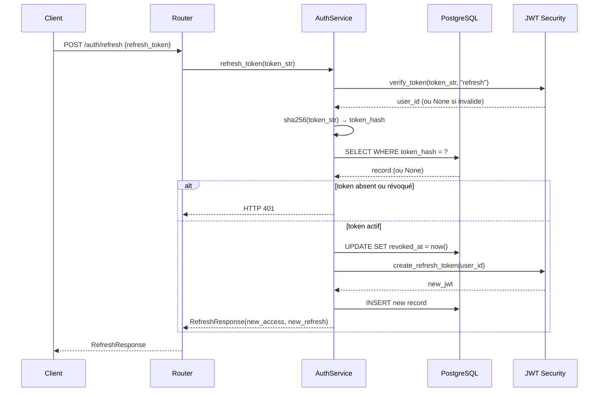

# Design Document — TASK-02 : Refresh Token persisté en base de données

## Overview

Ce document décrit l'architecture technique de la persistance des refresh tokens en PostgreSQL pour le projet TONDE Backend. L'objectif est de passer d'une architecture stateless (token JWT non révocable) à une architecture stateful permettant la révocation de session, la rotation de token et le support multi-device, tout en conservant la signature JWT existante dans `security.py`.

### Contexte du problème

L'implémentation actuelle de `AuthService.refresh_token()` vérifie uniquement la signature JWT. Il n'existe aucun mécanisme de révocation, aucun endpoint `/logout`, et un token volé reste valide pendant toute sa durée de vie de 7 jours. La DÉCISION 3 de `decisions.md` valide la solution : persistance d'un enregistrement `refresh_tokens` en base avec le `sha256(token)` comme identifiant de session.

---

## Architecture

### Vue d'ensemble

```mermaid
flowchart TD
    Client["Client Mobile"]
    Router["Router auth.py"]
    Service["AuthService"]
    DB["PostgreSQL\nrefresh_tokens"]
    JWT["JWT Security\nsecurity.py"]

    Client -->|POST /auth/refresh\n{refresh_token}| Router
    Router --> Service
    Service -->|verify_token\nJSON payload| JWT
    Service -->|sha256 lookup| DB
    Service -->|revoke old\ninsert new| DB
    Service -->|new access_token\nnew refresh_token| Router
    Router --> Client
```

### Principe de fonctionnement

Le JWT lui-même reste signé via `create_refresh_token()` dans `security.py` — la signature n'est pas modifiée. Ce qui change : après validation JWT, le service effectue une **vérification de présence en base** (`token_hash = sha256(token_reçu)`). Si l'enregistrement est absent ou révoqué, la demande est rejetée même si la signature JWT est valide.

Cette double validation (signature + base) est le cœur de la sécurité : un token volé mais révoqué est rejeté dès le prochain appel à `/refresh`.

---

## Components and Interfaces

### 1. `app/models/refresh_token.py` (nouveau)

Modèle SQLAlchemy 2.0 pour la table `refresh_tokens`.

```python
class RefreshToken(Base):
    __tablename__ = "refresh_tokens"

    id: Mapped[str] = mapped_column(String(36), primary_key=True, default=lambda: str(uuid.uuid4()))
    user_id: Mapped[str] = mapped_column(String(36), ForeignKey("users.id", ondelete="CASCADE"), nullable=False, index=True)
    token_hash: Mapped[str] = mapped_column(String(64), unique=True, nullable=False)  # SHA-256 hex = 64 chars
    device_id: Mapped[str | None] = mapped_column(String(255), nullable=True, index=True)
    ip_address: Mapped[str | None] = mapped_column(String(45), nullable=True)  # IPv4 ou IPv6
    expires_at: Mapped[datetime] = mapped_column(DateTime(timezone=True), nullable=False)
    revoked_at: Mapped[datetime | None] = mapped_column(DateTime(timezone=True), nullable=True)
    created_at: Mapped[datetime] = mapped_column(DateTime(timezone=True), default=lambda: datetime.now(timezone.utc))
```

**Index supplémentaires :**
- Index composite `(user_id, revoked_at)` pour les requêtes `logout/all` (filtrage des sessions actives d'un utilisateur)
- Index sur `token_hash` (implicite via `unique=True`)

### 2. `app/schemas/auth.py` (modifications)

#### Nouveaux schémas

```python
class LogoutRequest(BaseModel):
    refresh_token: str

class RefreshResponse(BaseModel):
    success: bool = True
    access_token: str
    refresh_token: str
    token_type: str = "bearer"
```

#### Schémas modifiés

- `VerifyOtpRequest` : ajout de `device_id: str | None = None`
- `RegisterEmailRequest` : ajout de `device_id: str | None = None`
- `LoginEmailRequest` : ajout de `device_id: str | None = None`
- `AuthResponse` : ajout de `device_id: str | None = None`

### 3. `app/services/auth_service.py` (modifications)

#### Méthodes modifiées

**`_create_auth_response(user, device_id, ip_address)` → `async`**

La méthode devient asynchrone pour persister le refresh token. Elle crée le JWT via `create_refresh_token(user.id)`, calcule le hash SHA-256, extrait `expires_at` depuis le payload JWT, et insère l'enregistrement en base.

```
_create_auth_response(user, device_id=None, ip_address=None) → AuthResponse
  1. jwt_token = create_refresh_token(user.id)
  2. token_hash = sha256(jwt_token)
  3. expires_at = decode(jwt_token).exp  # extraire depuis le payload
  4. IF device_id → révoquer l'ancienne session pour ce device_id
  5. INSERT refresh_tokens (id, user_id, token_hash, device_id, ip_address, expires_at)
  6. RETURN AuthResponse(access_token, refresh_token=jwt_token, device_id)
```

**`refresh_token(refresh_token_str)` → rotation complète**

```
refresh_token(token_str) → RefreshResponse
  1. user_id = verify_token(token_str, type="refresh")  # validation JWT
  2. IF not user_id → HTTP 401 INVALID_REFRESH_TOKEN
  3. token_hash = sha256(token_str)
  4. record = SELECT * FROM refresh_tokens WHERE token_hash = ?
  5. IF not record → HTTP 401 INVALID_REFRESH_TOKEN
  6. IF record.revoked_at IS NOT NULL → HTTP 401 TOKEN_REVOKED
  7. IF record.expires_at < now() → HTTP 401 TOKEN_EXPIRED
  8. record.revoked_at = now()  # révoquer l'ancien
  9. new_token = create_refresh_token(user_id)  # créer le nouveau
  10. INSERT refresh_tokens (nouveau hash, même user_id/device_id/ip)
  11. RETURN RefreshResponse(new_access_token, new_refresh_token)
```

#### Nouvelles méthodes

**`logout(refresh_token_str)` → révocation d'une session**

```
logout(token_str) → dict
  1. token_hash = sha256(token_str)
  2. record = SELECT * FROM refresh_tokens WHERE token_hash = ?
  3. IF not record → HTTP 401 INVALID_REFRESH_TOKEN
  4. IF record.revoked_at IS NOT NULL → HTTP 400 TOKEN_ALREADY_REVOKED
  5. record.revoked_at = now()
  6. RETURN {"success": True, "message": "Déconnecté avec succès"}
```

**`logout_all(user_id)` → révocation de toutes les sessions**

```
logout_all(user_id) → dict
  1. UPDATE refresh_tokens SET revoked_at = now()
     WHERE user_id = ? AND revoked_at IS NULL
  2. count = rowcount
  3. RETURN {"success": True, "message": "Toutes les sessions révoquées", "sessions_revoked": count}
```

### 4. `app/routers/auth.py` (modifications)

Deux nouveaux endpoints et mise à jour de `/refresh` pour retourner `RefreshResponse`.

```python
POST /auth/logout       → body: LogoutRequest (sans auth)
POST /auth/logout/all   → Depends(get_current_user) (avec Bearer token)
```

### 5. Migration Alembic

Commande : `alembic revision --autogenerate -m "add_refresh_tokens_table"`

La migration doit créer :
- La table `refresh_tokens` avec tous les champs
- L'index composite `(user_id, revoked_at)` nommé `ix_refresh_tokens_user_active`
- La contrainte FK avec `ON DELETE CASCADE`

---

## Data Models

### Table `refresh_tokens`

| Colonne | Type SQL | Contraintes | Description |
|---------|----------|-------------|-------------|
| `id` | `VARCHAR(36)` | PK, NOT NULL | UUID v4 |
| `user_id` | `VARCHAR(36)` | FK users.id CASCADE DELETE, NOT NULL, INDEX | Propriétaire du token |
| `token_hash` | `VARCHAR(64)` | UNIQUE, NOT NULL | SHA-256 hex du JWT |
| `device_id` | `VARCHAR(255)` | NULL, INDEX | Identifiant device opaque |
| `ip_address` | `VARCHAR(45)` | NULL | IPv4 ou IPv6 |
| `expires_at` | `TIMESTAMPTZ` | NOT NULL | Expiration du JWT (copie) |
| `revoked_at` | `TIMESTAMPTZ` | NULL | NULL = session active |
| `created_at` | `TIMESTAMPTZ` | NOT NULL, DEFAULT now() | Date d'émission |

**Index :**
- `PRIMARY KEY (id)`
- `UNIQUE (token_hash)` — index implicite
- `INDEX (user_id)`
- `INDEX (device_id)`
- `INDEX (user_id, revoked_at)` — optimise `logout/all` et la liste des sessions actives

### Lecture de `expires_at` depuis le payload JWT

```python
import hashlib
from jose import jwt as jose_jwt
from app.core.config import settings

def _hash_token(token: str) -> str:
    return hashlib.sha256(token.encode()).hexdigest()

def _get_token_expiry(token: str) -> datetime:
    """Extrait expires_at depuis le payload JWT sans re-vérifier la signature."""
    payload = jose_jwt.decode(
        token,
        settings.JWT_SECRET_KEY,
        algorithms=[settings.JWT_ALGORITHM],
        options={"verify_exp": False},  # déjà vérifié par verify_token()
    )
    return datetime.fromtimestamp(payload["exp"], tz=timezone.utc)
```

### Diagramme de séquence — POST /auth/refresh (rotation)



---

## Correctness Properties

*Une propriété est une caractéristique ou un comportement qui doit rester vrai pour toutes les exécutions valides d'un système — essentiellement un énoncé formel de ce que le système doit faire. Les propriétés servent de pont entre les spécifications lisibles par l'humain et les garanties de correction vérifiables automatiquement.*

### Property 1 : Persistance à l'émission

*Pour tout* utilisateur valide et toute méthode de connexion (`verify_otp`, `register_email`, `login_email`), après un appel réussi, la table `refresh_tokens` doit contenir exactement un enregistrement actif lié à cet utilisateur, et le champ `token_hash` de cet enregistrement doit être égal à `sha256(refresh_token_retourné)`.

**Validates: Requirements 1.1, 2.1**

---

### Property 2 : Token hash — jamais en clair

*Pour tout* refresh token JWT émis, la valeur stockée dans `token_hash` ne doit jamais être identique au token JWT brut, et doit toujours être égale à `hashlib.sha256(token_jwt.encode()).hexdigest()`.

**Validates: Requirements 1.2, 8.1, 8.4**

---

### Property 3 : Rotation — l'ancien token est révoqué

*Pour tout* utilisateur possédant un refresh token actif, après un appel réussi à `POST /auth/refresh`, l'enregistrement correspondant à l'ancien token doit avoir `revoked_at` non NULL, et un nouvel enregistrement actif (`revoked_at` NULL) doit exister pour le même `user_id`.

**Validates: Requirements 3.4**

---

### Property 4 : Token révoqué rejeté au refresh

*Pour tout* refresh token dont `revoked_at` est non NULL, un appel à `POST /auth/refresh` avec ce token doit retourner HTTP 401 avec le code `TOKEN_REVOKED`, même si la signature JWT est encore valide.

**Validates: Requirements 3.3**

---

### Property 5 : Logout révoque exactement un token

*Pour tout* utilisateur avec N sessions actives (N ≥ 2), après un appel à `POST /auth/logout` avec un token spécifique, exactement N-1 sessions actives doivent subsister — le token ciblé est révoqué, les autres restent intacts.

**Validates: Requirements 4.1, 6.3**

---

### Property 6 : Logout/all révoque toutes les sessions

*Pour tout* utilisateur avec N sessions actives (N ≥ 1), après un appel à `POST /auth/logout/all`, zéro session active doit subsister, et le champ `sessions_revoked` de la réponse doit être égal à N.

**Validates: Requirements 5.1, 5.3**

---

### Property 7 : Indépendance des sessions multi-device

*Pour tout* utilisateur avec M sessions actives sur M devices différents, logout d'un device ne doit pas modifier les sessions des (M-1) autres devices.

**Validates: Requirements 6.1, 6.3**

---

### Property 8 : device_id unique par session active

*Pour tout* device_id donné, si deux connexions successives sont effectuées avec le même device_id pour le même utilisateur, exactement une session active doit exister pour ce device_id après la deuxième connexion (la première est révoquée automatiquement).

**Validates: Requirements 6.2**

---

### Property 9 : expires_at cohérent avec le payload JWT

*Pour tout* refresh token émis, le champ `expires_at` stocké en base doit être égal à la date d'expiration (`exp`) contenue dans le payload JWT du token.

**Validates: Requirements 2.3**

---

## Error Handling

### Tableau des erreurs

| Situation | HTTP | Code | Message |
|-----------|------|------|---------|
| Token JWT invalide (signature) | 401 | `INVALID_REFRESH_TOKEN` | Token de rafraîchissement invalide |
| Token absent de la base | 401 | `INVALID_REFRESH_TOKEN` | Token de rafraîchissement invalide |
| Token révoqué (`revoked_at` non NULL) | 401 | `TOKEN_REVOKED` | Cette session a été révoquée |
| Token expiré (`expires_at` < now) | 401 | `TOKEN_EXPIRED` | Token de rafraîchissement expiré |
| Tentative de double révocation | 400 | `TOKEN_ALREADY_REVOKED` | Ce token est déjà révoqué |
| Erreur DB à la persistance | 500 | `INTERNAL_ERROR` | Erreur interne — réessayez |

### Règles de rollback

Toutes les opérations d'écriture en base (INSERT, UPDATE) sont encapsulées dans la session SQLAlchemy fournie par `get_db()`, qui effectue un `rollback()` automatique en cas d'exception. Aucune gestion manuelle de transaction n'est nécessaire dans le service.

### Sécurité des messages d'erreur

Les messages d'erreur ne doivent jamais révéler si un token existe en base ou non — utiliser le même code `INVALID_REFRESH_TOKEN` pour "absent" et "signature invalide". Seule l'erreur "révoqué" utilise un code distinct (`TOKEN_REVOKED`) car le client doit savoir qu'il doit se reconnecter.

---

## Testing Strategy

### Approche duale

- **Tests unitaires** : comportements spécifiques, cas d'erreur, intégration entre composants
- **Tests property-based** (hypothesis) : propriétés universelles vérifiées sur des entrées générées

### Librairie PBT : Hypothesis

```
hypothesis==6.x  # déjà dans le contexte Python du projet
```

Configuration : minimum 100 itérations par propriété (`@settings(max_examples=100)`).

### Tests property-based

Chaque propriété ci-dessus est implémentée comme un test Hypothesis dans `tests/test_refresh_token_properties.py`.

**Tag format :** `# Feature: sprint1-task02-refresh-token-db, Property N: <texte>`

```python
from hypothesis import given, settings as h_settings, strategies as st

@h_settings(max_examples=100)
@given(st.emails(), st.text(min_size=8, max_size=50))
async def test_property_1_persistance_emission(email, password):
    # Feature: sprint1-task02-refresh-token-db, Property 1: Persistance à l'émission
    ...
```

### Tests unitaires (exemples)

Dans `tests/test_auth_service.py` (extension du fichier existant) ou `tests/test_refresh_token_service.py` :

| Test | Scénario | Attendu |
|------|----------|---------|
| `test_logout_revokes_token` | Token actif → POST /logout | `revoked_at` non NULL |
| `test_revoked_token_rejected_on_refresh` | Token révoqué → POST /refresh | HTTP 401 TOKEN_REVOKED |
| `test_rotation_invalidates_old_token` | Token valide → POST /refresh | Ancien révoqué, nouveau créé |
| `test_multi_device_independent_sessions` | 3 devices, logout d'1 | 2 sessions restantes |
| `test_logout_all_revokes_all_sessions` | 3 sessions → logout/all | 0 sessions actives |
| `test_token_not_in_db_rejected` | JWT valide non en base | HTTP 401 |
| `test_device_id_replaces_existing_session` | Même device_id, 2e connexion | 1 session active pour ce device |
| `test_refresh_response_contains_new_refresh_token` | Rotation | `new_refresh != old_refresh` |

### Couverture des requirements

| Requirement | Tests property | Tests unitaires |
|-------------|----------------|-----------------|
| 1.1 Persistance émission | Property 1 | test_login_persists_refresh_token |
| 1.2 Hash SHA-256 | Property 2 | test_token_stored_as_hash |
| 1.4 CASCADE DELETE | Property 1 (via DB) | test_user_deletion_cascades |
| 2.2 device_id associé | Property 8 | test_device_id_stored |
| 2.3 expires_at JWT | Property 9 | test_expires_at_matches_jwt |
| 3.3 Révoqué rejeté | Property 4 | test_revoked_token_rejected_on_refresh |
| 3.4 Rotation | Property 3 | test_rotation_invalidates_old_token |
| 4.1 Logout révoque 1 | Property 5 | test_logout_revokes_token |
| 5.1/5.3 Logout/all | Property 6 | test_logout_all_revokes_all_sessions |
| 6.1 Multi-device | Property 7 | test_multi_device_independent_sessions |
| 6.2 device_id unique | Property 8 | test_device_id_replaces_existing_session |

### Note sur les tests d'intégration

La migration Alembic et l'existence de la table sont vérifiées par un test de smoke distinct (`tests/test_smoke_refresh_token_migration.py`) qui vérifie que `refresh_tokens` est dans `Base.metadata.tables` après import du modèle.
