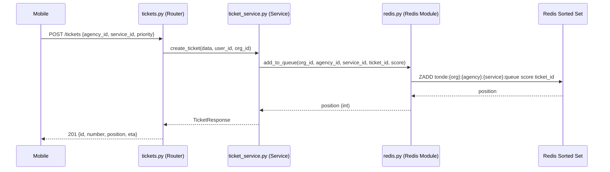

# Design Document — TASK-04 : Clés Redis segmentées par service

## Overview

Cette tâche applique la **DÉCISION 4** (decisions.md) : faire passer la clé de file d'attente Redis de deux segments `{org_id}/{agency_id}` à trois segments `{org_id}/{agency_id}/{service_id}`. Le changement est purement structurel — aucune migration de base de données n'est requise car `Ticket.service_id` existe déjà.

L'impact est en cascade sur quatre fichiers : `app/core/redis.py` (source de la clé), `app/services/ticket_service.py` (tous les appels Redis), `app/schemas/ticket.py` (`CallNextRequest`), et `app/routers/tickets.py` (forwarding du `service_id`).

---

## Architecture

### Hiérarchie des files Redis (après TASK-04)

```
Organisation (org_id)
└── Agence / Agency (agency_id)
    ├── Service Caisse (service_id_A)   → tonde:{org}:{agency}:{svc_A}:queue
    ├── Service Crédit (service_id_B)   → tonde:{org}:{agency}:{svc_B}:queue
    ├── Service Conseiller (service_id_C) → tonde:{org}:{agency}:{svc_C}:queue
    └── Service VIP (service_id_D)      → tonde:{org}:{agency}:{svc_D}:queue
```

Chaque `queue` est un **Redis Sorted Set** — le score garantit l'ordre de service (priorité + FIFO).

### Flux de données



---

## Components and Interfaces

### 1. `app/core/redis.py` — Redis Module

#### `_queue_key()` — clé de file

```python
def _queue_key(org_id: str, agency_id: str, service_id: str) -> str:
    """
    Génère la clé Redis de la file d'attente.
    Format : tonde:{org_id}:{agency_id}:{service_id}:queue
    
    Le service_id est le troisième segment — chaque service possède
    sa propre file indépendante dans la même agence.
    """
    return f"tonde:{org_id}:{agency_id}:{service_id}:queue"
```

#### Fonctions de file — nouvelles signatures

| Fonction | Avant | Après |
|---|---|---|
| `add_to_queue` | `(org_id, agency_id, ticket_id, priority)` | `(org_id, agency_id, service_id, ticket_id, priority)` |
| `get_queue_position` | `(org_id, agency_id, ticket_id)` | `(org_id, agency_id, service_id, ticket_id)` |
| `get_queue_size` | `(org_id, agency_id)` | `(org_id, agency_id, service_id)` |
| `remove_from_queue` | `(org_id, agency_id, ticket_id)` | `(org_id, agency_id, service_id, ticket_id)` |
| `get_next_ticket` | `(org_id, agency_id)` | `(org_id, agency_id, service_id)` |
| `get_queue_snapshot` | `(org_id, agency_id)` | `(org_id, agency_id, service_id)` |

### 2. `app/services/ticket_service.py` — Ticket Service

Tous les appels Redis reçoivent `service_id` en troisième argument. Le `service_id` est déjà disponible sur chaque chemin d'exécution :

| Méthode | Source du `service_id` |
|---|---|
| `create_ticket()` | `data.service_id` (champ du schéma d'entrée) |
| `get_ticket()` | `ticket.service_id` (champ du modèle SQLAlchemy) |
| `cancel_ticket()` | `ticket.service_id` (chargé depuis la DB) |
| `call_next()` | `service_id` (nouveau paramètre de `call_next()`, fourni par le body) |
| `return_to_queue()` | `ticket.service_id` (chargé depuis la DB) |

**Changement de signature de `call_next()`** :

```python
# Avant
async def call_next(self, agency_id: str, counter_id: str, counter_name: str, org_id: str) -> dict:

# Après
async def call_next(self, agency_id: str, service_id: str, counter_id: str, counter_name: str, org_id: str) -> dict:
```

### 3. `app/schemas/ticket.py` — CallNextRequest

```python
class CallNextRequest(BaseModel):
    """Requête du guichetier pour appeler le prochain ticket."""
    agency_id: str
    service_id: str   # ← NOUVEAU — champ obligatoire
    counter_id: str
    counter_name: str
```

### 4. `app/routers/tickets.py` — call_next endpoint

```python
result = await service.call_next(
    agency_id=body.agency_id,
    service_id=body.service_id,  # ← NOUVEAU
    counter_id=body.counter_id,
    counter_name=body.counter_name,
    org_id=current_user.org_id,
)
```

---

## Data Models

Aucune modification de base de données. Le champ `service_id` sur `Ticket` est déjà défini dans `app/models/ticket.py` et persisté en PostgreSQL. Cette tâche n'utilise que le champ existant pour construire la clé Redis.

### Convention de nommage des clés Redis (état final après TASK-04)

```
tonde:{org_id}:{agency_id}:{service_id}:queue   → file d'attente (Sorted Set)
tonde:otp:{phone}                                → OTP hashé (TTL 5 min)
tonde:otp_attempts:{phone}                       → compteur tentatives OTP
tonde:cache:{key}                                → cache général
tonde:events:{org_id}                            → canal Redis Pub/Sub (TASK-05)
```

---

## Correctness Properties

*Une propriété est une caractéristique qui doit rester vraie pour toutes les exécutions valides du système — une spécification formelle de ce que le système doit faire.*

### Property 1 : Format de la clé Redis

*Pour tout* triplet `(org_id, agency_id, service_id)` de chaînes non-vides, `_queue_key(org_id, agency_id, service_id)` doit retourner exactement `f"tonde:{org_id}:{agency_id}:{service_id}:queue"`.

**Validates: Requirements 1.1, 1.2**

### Property 2 : Isolation des files par service

*Pour tout* `org_id`, `agency_id`, et toute paire `(service_id_A, service_id_B)` telle que `service_id_A != service_id_B`, les clés `_queue_key(org_id, agency_id, service_id_A)` et `_queue_key(org_id, agency_id, service_id_B)` doivent être différentes.

**Validates: Requirements 2.7, 5.1, 5.3**

---

## Error Handling

| Situation | Comportement attendu |
|---|---|
| `service_id` manquant dans l'appel Python | `TypeError` levé par l'interpréteur Python (paramètre obligatoire sans valeur par défaut) |
| `service_id` absent du body JSON de `CallNextRequest` | HTTP 422 Unprocessable Entity — Pydantic v2 lève une `ValidationError` automatiquement |
| `service_id` ne correspond à aucun service existant | Comportement inchangé — la vérification du service en DB se fait en amont dans `create_ticket()` via `_get_service()`; pour `call_next()`, si la file est vide, retour `{"success": False, "message": "Aucun ticket en attente"}` |
| Clé Redis inexistante (file vide) | `ZRANGE` retourne `[]`, `ZCARD` retourne `0`, `ZRANK` retourne `None` → comportements déjà gérés dans le code existant |

---

## Testing Strategy

### Bibliothèque de tests

- **Framework** : `pytest` + `pytest-asyncio` (déjà configurés dans le projet)
- **Property-based testing** : `hypothesis` — à ajouter aux dépendances de développement si non présent (`pip install hypothesis`)
- **Mocks** : `unittest.mock.AsyncMock` (déjà utilisé dans `tests/conftest.py`)

### Approche duale

**Tests unitaires (exemples)** pour les cas de forwarding de `service_id` dans la couche service :
- `test_create_ticket_passes_service_id_to_redis` : vérifie que `add_to_queue` est appelé avec le `service_id` correct
- `test_call_next_passes_service_id_to_get_next_ticket` : vérifie le forwarding dans `call_next()`
- `test_cancel_ticket_passes_service_id_to_remove_from_queue` : vérifie l'annulation
- `test_callnextrequest_requires_service_id` : vérifie que `CallNextRequest` sans `service_id` lève `ValidationError`

**Tests property-based** pour les invariants de la fonction `_queue_key()` (pure, sans I/O) :
- **Property 1** — `test_queue_key_format_property` : 100+ itérations avec `hypothesis`
- **Property 2** — `test_two_services_have_independent_queues` : 100+ itérations avec `hypothesis`

### Mise à jour des tests existants

`tests/test_ticket_service.py` — la fixture `mock_queue` doit être mise à jour pour utiliser les nouvelles signatures :

```python
@pytest.fixture
def mock_queue(mock_redis):
    """Mock des helpers Redis de file d'attente — signatures avec service_id."""
    with patch("app.services.ticket_service.add_to_queue", new_callable=AsyncMock, return_value=1):
        with patch("app.services.ticket_service.get_queue_size", new_callable=AsyncMock, return_value=1):
            with patch("app.services.ticket_service.remove_from_queue", new_callable=AsyncMock):
                with patch("app.services.ticket_service.get_next_ticket", new_callable=AsyncMock):
                    with patch("app.services.ticket_service.get_queue_position", new_callable=AsyncMock, return_value=1):
                        yield
```

Les mocks restent identiques structurellement — le changement de signature côté implémentation n'impacte pas le comportement des mocks `AsyncMock`, mais les tests qui vérifient les arguments d'appel (`call_args`) doivent asserter la présence du `service_id`.

### Configuration property tests

Chaque test property doit être annoté :

```python
# Feature: sprint1-task04-redis-queue-key, Property 1: Queue key format
@given(org_id=text(min_size=1), agency_id=text(min_size=1), service_id=text(min_size=1))
@settings(max_examples=100)
def test_queue_key_format_property(org_id, agency_id, service_id):
    ...
```
