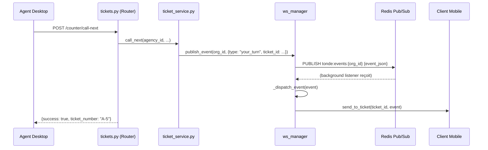

# Design Document — TASK-05 : Redis Pub/Sub activé

## Overview

Deux changements chirurgicaux pour activer l'architecture événementielle temps réel :

1. **`app/websocket/queue_ws.py`** — réécrire `start_redis_listener()` : supprimer le paramètre `org_id`, utiliser `psubscribe("tonde:events:*")`, ajouter la boucle `while True` avec backoff 5s.
2. **`app/main.py`** — brancher `asyncio.create_task(ws_manager.start_redis_listener())` dans `lifespan()`.

Aucun nouveau fichier, aucune migration, aucun changement de schéma.

---

## Architecture

### Avant TASK-05 (état actuel)

```
Queue Engine (service)
    │
    ▼
ws_manager.notify_your_turn()     ← appel DIRECT, couplé
ws_manager.broadcast_to_agency()  ← appel DIRECT, couplé
```

Le service parle directement au WebSocket Manager. Si 2 instances du serveur tournent derrière un load balancer, le client connecté sur le serveur B ne reçoit jamais l'événement publié sur le serveur A.

### Après TASK-05 (architecture cible)

```
Queue Engine (service)
    │
    ▼
ws_manager.publish_event(org_id, event)   ← publie dans Redis
    │
    ▼
Redis Pub/Sub  (canal tonde:events:{org_id})
    │
    ▼
start_redis_listener()   ← background task sur CHAQUE instance serveur
    │
    ▼
_dispatch_event(event)   ← route vers le bon client WebSocket
    │
    ├── send_to_ticket(ticket_id, event)
    └── broadcast_to_agency(agency_id, event)
```

Chaque instance du serveur écoute Redis et diffuse aux clients qui lui sont connectés. `publish_event()` est déjà implémenté dans `queue_ws.py` — seul le listener manque.

### Diagramme de séquence — call_next avec Pub/Sub



---

## Components and Interfaces

### 1. `app/websocket/queue_ws.py` — `start_redis_listener()` réécrite

**Avant (état actuel) :**
```python
async def start_redis_listener(self, org_id: str) -> None:
    """TODO Sprint 1 : intégrer dans le lifespan de main.py"""
    r = await get_redis()
    channel = REDIS_EVENTS_CHANNEL.format(org_id=org_id)
    async with r.pubsub() as pubsub:
        await pubsub.subscribe(channel)       # ← subscribe (1 canal fixe)
        async for message in pubsub.listen():
            if message["type"] != "message":  # ← seulement "message"
                continue
            event = json.loads(message["data"])
            await self._dispatch_event(event)
            # ← pas de reconnexion automatique
```

**Après :**
```python
async def start_redis_listener(self) -> None:
    """
    Écoute tous les événements TONDE via Redis Pub/Sub (pattern subscribe).

    Démarre en tâche asyncio de fond via asyncio.create_task() dans main.py.
    Se reconnecte automatiquement toutes les 5 secondes en cas d'erreur Redis.

    Le pattern tonde:events:* capture les événements de toutes les organisations
    sans avoir besoin de démarrer un listener par org_id.
    """
    while True:
        try:
            r = await get_redis()
            async with r.pubsub() as pubsub:
                await pubsub.psubscribe("tonde:events:*")
                logger.info("Redis Pub/Sub — écoute active sur tonde:events:*")

                async for message in pubsub.listen():
                    # psubscribe produit des messages de type "pmessage"
                    if message["type"] not in ("message", "pmessage"):
                        continue

                    data = message.get("data")
                    if not data:
                        continue

                    try:
                        event = json.loads(data)
                        await self._dispatch_event(event)
                    except json.JSONDecodeError as e:
                        logger.error(f"Redis Pub/Sub — message JSON invalide: {e}")
                    except Exception as e:
                        logger.error(f"Redis Pub/Sub — erreur dispatch: {e}", exc_info=True)

        except Exception as e:
            logger.error(
                f"Redis Pub/Sub — déconnecté: {e}. Reconnexion dans 5s...",
                exc_info=True,
            )
            await asyncio.sleep(5)
```

**Changements clés :**
- Suppression du paramètre `org_id`
- `subscribe(channel)` → `psubscribe("tonde:events:*")`
- `"message"` → `("message", "pmessage")` dans le filtre de type
- Boucle `while True` avec `asyncio.sleep(5)` en cas d'exception
- Gestion séparée des erreurs JSON et des erreurs dispatch (ne cassent pas la boucle principale)

### 2. `app/main.py` — lifespan mis à jour

**Avant :**
```python
# Vérifier la connexion Redis
redis = await get_redis()
await redis.ping()
logger.info("Redis — Connexion établie")

logger.info(f"API prête sur http://localhost:{settings.APP_PORT}")
```

**Après :**
```python
import asyncio  # ← ajouter en tête de fichier

# Dans lifespan(), après le ping Redis :
redis = await get_redis()
await redis.ping()
logger.info("Redis — Connexion établie")

# Démarrer le listener Redis Pub/Sub en tâche de fond
asyncio.create_task(ws_manager.start_redis_listener())
logger.info("Redis Pub/Sub — Listener démarré en tâche de fond")

logger.info(f"API prête sur http://localhost:{settings.APP_PORT}")
```

`asyncio.create_task()` retourne immédiatement — le démarrage de l'app n'est pas bloqué. La tâche tourne en arrière-plan pour toute la durée de vie de l'application.

### 3. `_dispatch_event()` — aucun changement

La méthode existante route déjà correctement selon le `type` de l'événement. Elle reste inchangée :

```python
async def _dispatch_event(self, event: dict) -> None:
    event_type = event.get("type")

    if event_type == EventType.YOUR_TURN:
        await self.send_to_ticket(event["ticket_id"], event)
    elif event_type == EventType.TICKET_CALLED:
        await self.broadcast_to_agency(event["agency_id"], event)
    elif event_type == EventType.QUEUE_UPDATE:
        await self.send_to_ticket(event["ticket_id"], event)
    elif event_type == EventType.BROADCAST_MESSAGE:
        await self.broadcast_to_agency(event["agency_id"], event)
    else:
        logger.debug(f"Événement non routé : {event_type}")
```

---

## Data Models

Aucun changement de modèle de données. Aucune migration Alembic.

**Canaux Redis utilisés (inchangés) :**
```
Publication  : tonde:events:{org_id}          ← publish_event() déjà en place
Souscription : psubscribe tonde:events:*      ← TASK-05 change subscribe → psubscribe
```

---

## Correctness Properties

### Property 1 : Événement publié → dispatché

*Pour tout* événement publié via `ws_manager.publish_event(org_id, event)`, le listener doit appeler `_dispatch_event(event)` avec exactement le même dict désérialisé.

**Validates: Requirements 4.1, 4.2, 4.3, 4.4**

### Property 2 : Message malformé → ne casse pas la boucle

*Pour tout* message Redis dont le champ `data` n'est pas du JSON valide, le listener doit logger l'erreur et continuer à traiter les messages suivants sans s'arrêter.

**Validates: Requirements 5.1, 5.2**

### Property 3 : Reconnexion après exception

*Pour toute* exception levée dans la boucle principale, le listener doit attendre 5 secondes puis se reconnecter — la boucle `while True` ne doit jamais se terminer tant que l'application tourne.

**Validates: Requirements 2.1, 2.2, 2.3, 2.4**

---

## Error Handling

| Situation | Comportement |
|---|---|
| Redis indisponible au démarrage | `start_redis_listener()` lève une exception → capturée par `while True` → backoff 5s → retry |
| Redis tombe pendant l'écoute | Exception dans `pubsub.listen()` → capturée → backoff 5s → reconnexion |
| Message JSON invalide | `json.JSONDecodeError` capturé → log ERROR → message suivant traité normalement |
| `_dispatch_event()` lève une exception | Exception capturée → log ERROR → message suivant traité normalement |
| Message de type inconnu (`subscribe`, `psubscribe`) | Filtré silencieusement via `if message["type"] not in (...)` |
| `data` vide ou None | `if not data: continue` — ignoré silencieusement |

---

## Testing Strategy

### Approche

Les tests pour TASK-05 sont des **tests unitaires avec mocks** — pas de vraie connexion Redis.

Le listener est une boucle asyncio infinie — les tests doivent la contrôler via des mocks qui épuisent la boucle après N messages.

### Pattern de test recommandé

```python
@pytest.mark.asyncio
async def test_listener_dispatches_event(ws_manager):
    event = {"type": "your_turn", "ticket_id": "t-123", ...}

    # Mock pubsub qui retourne un message puis se ferme
    mock_message = {"type": "pmessage", "data": json.dumps(event)}

    mock_pubsub = AsyncMock()
    mock_pubsub.__aenter__ = AsyncMock(return_value=mock_pubsub)
    mock_pubsub.__aexit__ = AsyncMock(return_value=None)
    mock_pubsub.psubscribe = AsyncMock()
    mock_pubsub.listen = AsyncMock(return_value=aiter([mock_message]))

    mock_redis = AsyncMock()
    mock_redis.pubsub.return_value = mock_pubsub

    with patch("app.websocket.queue_ws.get_redis", return_value=mock_redis):
        with patch.object(ws_manager, "_dispatch_event", new_callable=AsyncMock) as mock_dispatch:
            # Lancer le listener et l'annuler après le premier dispatch
            task = asyncio.create_task(ws_manager.start_redis_listener())
            await asyncio.sleep(0.1)
            task.cancel()

    mock_dispatch.assert_called_once_with(event)
```

### Tests à écrire dans `tests/test_queue_ws.py`

| Test | Ce qu'il vérifie |
|---|---|
| `test_listener_dispatches_your_turn_event` | Event `your_turn` → `send_to_ticket` appelé |
| `test_listener_dispatches_ticket_called_event` | Event `ticket_called` → `broadcast_to_agency` appelé |
| `test_listener_skips_non_message_types` | Message type `subscribe` → `_dispatch_event` non appelé |
| `test_listener_handles_invalid_json_gracefully` | `data` non-JSON → pas d'exception, boucle continue |
| `test_listener_handles_dispatch_exception_gracefully` | `_dispatch_event` lève → pas d'exception, boucle continue |
| `test_listener_reconnects_after_redis_exception` | Redis lève → backoff → reconnexion tentée |
